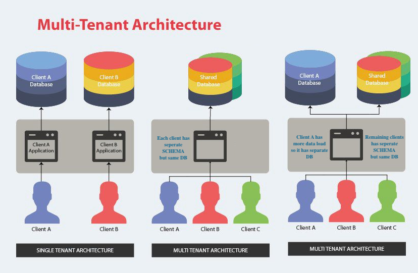
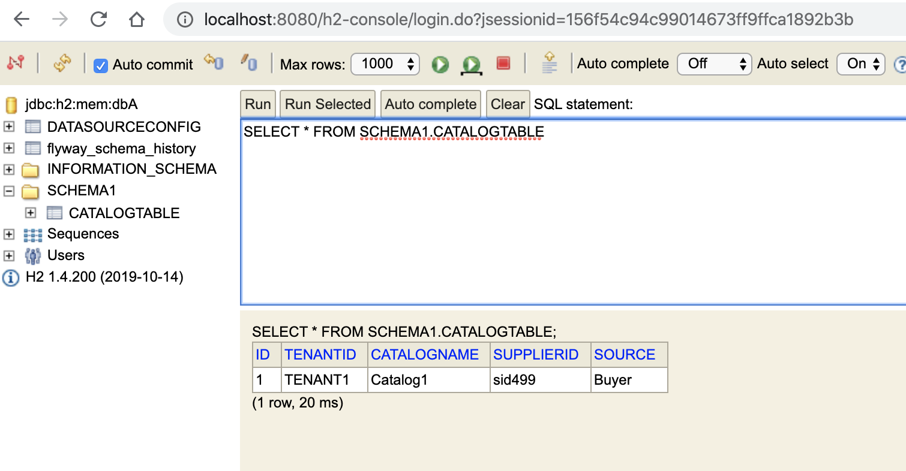
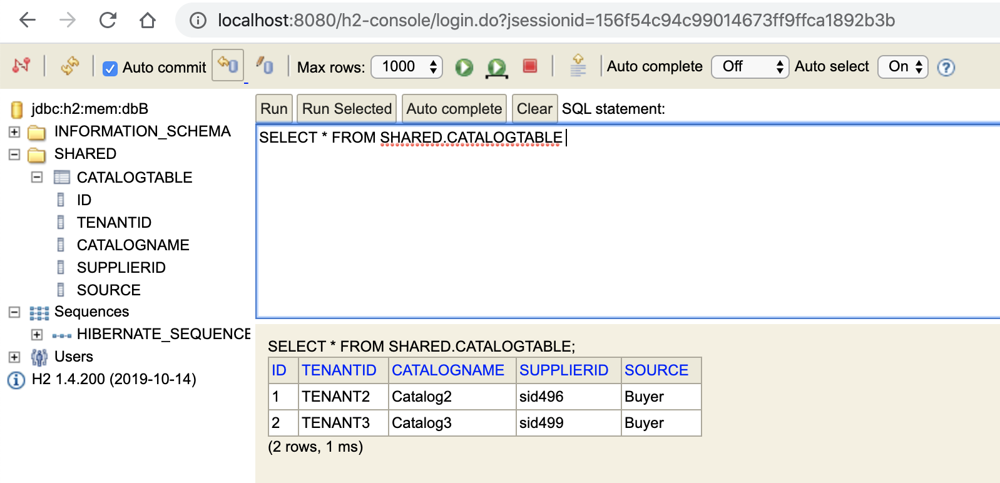

Multi-Tenancy Modelling for Microservice
----------------------------------------

Multi-Tenancy with the SaaS based model does not bring any change on the application layer as 
multiple services deployment of application would be able to accomodate the 
load on application but it would matter how do we decide the modelling of the database w.r.t. Multi-Tenancy.

<pre> 
<b>Cost</b>
Cost per tenants if seprate DB/SCHEMA is selected per tenants. 

<b>Performance</b>
Application performance & scalability would impact based on the 
number of tenants, data size per tenants and the workload.

<b>Time</b>
Development & Release migration effots when multiple 
databases/schemas are in production. Complexity for managing 
the operations for maitaining multiple DBs.
</pre> 

Tenancy Modelling  

### Database per Tenant
Single Tenant Architecture where each tenant has its own database and is isolated from other tenants.

### Shared Database
Multi Tenant Architecture with separate schema where all tenants share a database, but have their own database schemas and tables.


### Shared Database & Shared Schema
Multi Tenant Architecture with all tenants share a database and tables. Every table has a Column with the Tenant Identifier, that shows the tenant of the row.





Various multitenancy strategy supported by Hibernate are
<pre>
public enum MultiTenancyStrategy {
  DISCRIMINATOR,
  SCHEMA,
  DATABASE,
  NONE;
}
</pre>

DISCRIMINATOR strartegy work in progress and from the docuemntaiton of hibernate
<pre>
DISCRIMINATOR strartegy  Correlates to the partitioned 
(discriminator) approach. It is an error to attempt to 
open a session without a tenant identifier using this 
strategy. This strategy is not yet implemented 
and you can follow its progress via the HHH-6054 Jira issue.
</pre>


[JIRA HHH-6054](https://hibernate.atlassian.net/browse/HHH-6054) is currently in ***Open*** Status


Here in the example following modules/projects shows the example to achieve the tenancy modelling using
SCHEMA (shared db, separate schema) strategy per tenant based approach and SCHEMA (shared db, shared schema) strategy for different tenants.

**multitenancy-op2** project shows the example with the multiple tenants share the same database but different schemas.

**multitenancy-op3** project shows the example of the hybrid approach of with the tenants are grouped againsts the specific database and schema. 
This would give an ability to map a specific tenant with single database as well when the high load is expected for a tenant in comparision to others.


# Project multitenancy-op2

UseCase is where database is same (**dbA**) and every TENANT is  using specific Schema i.e.

Tenant wise DB and Schema mapping.

|TENANTID |   DB | SCHEMA|
|---------|------|-------|
|TENANT1  |dbA   |SCHEMA1|
|TENANT2  |dbA   |SCHEMA2|

#### Build and run multitenancy-op2 project
```
cd multitenancy-op2
mvn clean package
mvn spring-boot:run
```

Fly integration would be creating necessary tables in database dbA

Catalog creation request for TENANT1 which would insert data into table SCHEMA1.CATALOGTABLE
```
curl -X POST http://localhost:8080/catalog -H 'content-type: application/json' -H 'tenantid: TENANT1' -d '{"tenantId":"TENANT1","catalogName":"Catalog1","supplierId":"supplier1","source":"X-Systems"}'
```

Catalog creation request for TENANT2 which would insert data into table SCHEMA2.CATALOGTABLE

```
curl -X POST http://localhost:8080/catalog -H 'content-type: application/json' -H 'tenantid: TENANT2' -d '{"tenantId":"TENANT2","catalogName":"Catalog2","supplierId":"supplier2","source":"Y-Systems"}'
```

Catalog retrival reqeust for TENANT1
```
curl -X GET 'http://localhost:8080/catalog?catalogId=1' -H 'content-type: application/json' -H 'tenantid: TENANT1'
```

Catalog retrival reqeust for TENANT2
```
curl -X GET 'http://localhost:8080/catalog?catalogId=2' -H 'content-type: application/json' -H 'tenantid: TENANT2'
```


# Project multitenancy-op3


UseCase is as the hybrid approach to accomodate following cases:
1. Tenant(s) with higher load using the dedicated database and single schema (**TENANT1**).
2. Tenant(s) with moderate load can use same database but different schema (**approach in multenancy-op2 project**).
3. Tenant(s) with lower loads can share the DB SCHEMA (**TENANT2 and TENANT3**).

Tenant wise DB and Schema mapping.

|TENANTID |   DB | SCHEMA|
|---------|------|-------|
|TENANT1  |dbA   |SCHEMA1|
|TENANT2  |dbB   |SHARED |
|TENANT3  |dbB   |SHARED |


#### Build and run multitenancy-op3 project
```
cd multitenancy-op3
mvn clean package
mvn spring-boot:run
```

#####Create the following schema manually
```
create schema if not exists SHARED;
create table SHARED.catalogtable(id bigint, tenantid varchar(10), catalogname varchar(30), supplierid varchar(30), source varchar(10));
CREATE SEQUENCE SHARED.hibernate_sequence START WITH 1 INCREMENT BY 1 NO MINVALUE NO MAXVALUE CACHE 1;
```
##### Sample request for catalog creation

Catalog creation request for TENANT1 which would insert data into table SCHEMA1.CATALOGTABLE in database dbA

```
curl -X POST http://localhost:8080/catalog -H 'content-type: application/json' -H 'tenantid: TENANT1' -d '{"tenantId":"TENANT1","catalogName":"Catalog1","supplierId":"supplier1","source":"X-Systems"}'
```

Catalog creation request for TENANT2 which would insert data into table SHARED.CATALOGTABLE in database dbB
B

```
curl -X POST http://localhost:8080/catalog -H 'content-type: application/json' -H 'tenantid: TENANT2' -d '{"tenantId":"TENANT2","catalogName":"Catalog2","supplierId":"supplier2","source":"X-Systems"}'
```
Catalog creation request for TENANT3 which would insert data into table SHARED.CATALOGTABLE in database dbB

```
curl -X POST http://localhost:8080/catalog -H 'content-type: application/json' -H 'tenantid: TENANT3' -d '{"tenantId":"TENANT3","catalogName":"Catalog3","supplierId":"supplier3","source":"Y-Systems"}'
```


Inserted records can be verified at http://localhost:8080/h2-console/ by logging into
use database **dbA** (jdbc:h2:mem:dbA) for TENANT1 in schema SCHEMA1




use database **dbB** (jdbc:h2:mem:dbB) for TENANT2 and TENANT3 in schema SHARED


##### Sample request for catalog retrival
```
curl -X GET 'http://localhost:8080/catalog?catalogId=1' -H 'content-type: application/json' -H 'tenantid: TENANT1'
```

Catalog retrival reqeust for TENANT2
```
curl -X GET 'http://localhost:8080/catalog?catalogId=1' -H 'content-type: application/json' -H 'tenantid: TENANT2'
```

Catalog retrival reqeust for TENANT3
```
curl -X GET 'http://localhost:8080/catalog?catalogId=2' -H 'content-type: application/json' -H 'tenantid: TENANT3'
```