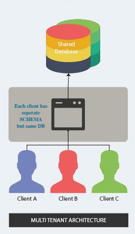

#multitenancy-op2

UseCase is where database is same (**dbA**) and every TENANT is  using specific Schema i.e.

Tenant wise DB and Schema mapping.

|TENANTID |   DB | SCHEMA|
|---------|------|-------|
|TENANT1  |dbA   |SCHEMA1|
|TENANT2  |dbA   |SCHEMA2|



#### Build and run multitenancy-op2 project
```
cd multitenancy-op2
mvn clean package
mvn spring-boot:run
```

Fly integration would be creating necessary tables in database dbA

Catalog creation request for TENANT1 which would insert data into table SCHEMA1.CATALOGTABLE
```
curl -X POST http://localhost:8080/catalog -H 'content-type: application/json' -H 'tenantid: TENANT1' -d '{"tenantId":"TENANT1","catalogName":"Catalog1","supplierId":"supplier1","source":"X-Systems"}'
```

Catalog creation request for TENANT2 which would insert data into table SCHEMA2.CATALOGTABLE

```
curl -X POST http://localhost:8080/catalog -H 'content-type: application/json' -H 'tenantid: TENANT2' -d '{"tenantId":"TENANT2","catalogName":"Catalog2","supplierId":"supplier2","source":"Y-Systems"}'
```

Catalog retrival reqeust for TENANT1
```
curl -X GET 'http://localhost:8080/catalog?catalogId=1' -H 'content-type: application/json' -H 'tenantid: TENANT1'
```

Catalog retrival reqeust for TENANT2
```
curl -X GET 'http://localhost:8080/catalog?catalogId=2' -H 'content-type: application/json' -H 'tenantid: TENANT2'
```