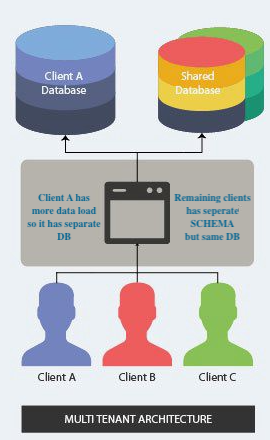

# multitenancy-op3


UseCase is as the hybrid approach to accomodate following cases:
1. Tenant(s) with higher load using the dedicated database and single schema (**TENANT1**).
2. Tenant(s) with moderate load can use same database but different schema (**approach in multenancy-op2 project**).
3. Tenant(s) with lower loads can share the DB SCHEMA (**TENANT2 and TENANT3**).

Tenant wise DB and Schema mapping.

|TENANTID |   DB | SCHEMA|
|---------|------|-------|
|TENANT1  |dbA   |SCHEMA1|
|TENANT2  |dbB   |SHARED |
|TENANT3  |dbB   |SHARED |



#### Build and run multitenancy-op3 project
```
cd multitenancy-op3
mvn clean package
mvn spring-boot:run
```

Fly integration would be creating necessary tables in database dbA but schema & table(s) needs to be created for database dbB 
#####Create the following schema manually
```
create schema if not exists SHARED;
create table SHARED.catalogtable(id bigint, tenantid varchar(10), catalogname varchar(30), supplierid varchar(30), source varchar(10));
CREATE SEQUENCE SHARED.hibernate_sequence START WITH 1 INCREMENT BY 1 NO MINVALUE NO MAXVALUE CACHE 1;
```
##### Sample request for catalog creation

Catalog creation request for TENANT1 which would insert data into table SCHEMA1.CATALOGTABLE in database dbA

```
curl -X POST http://localhost:8080/catalog -H 'content-type: application/json' -H 'tenantid: TENANT1' -d '{"tenantId":"TENANT1","catalogName":"Catalog1","supplierId":"supplier1","source":"X-Systems"}'
```

Catalog creation request for TENANT2 which would insert data into table SHARED.CATALOGTABLE in database dbB
B

```
curl -X POST http://localhost:8080/catalog -H 'content-type: application/json' -H 'tenantid: TENANT2' -d '{"tenantId":"TENANT2","catalogName":"Catalog2","supplierId":"supplier2","source":"X-Systems"}'
```
Catalog creation request for TENANT3 which would insert data into table SHARED.CATALOGTABLE in database dbB

```
curl -X POST http://localhost:8080/catalog -H 'content-type: application/json' -H 'tenantid: TENANT3' -d '{"tenantId":"TENANT3","catalogName":"Catalog3","supplierId":"supplier3","source":"Y-Systems"}'
```

Inserted records can be verified at http://localhost:8080/h2-console/ by logging into
use database **dbA** (jdbc:h2:mem:dbA) for TENANT1 in schema SCHEMA1


use database **dbB** (jdbc:h2:mem:dbB) for TENANT2 and TENANT3 in schema SHARED


##### Sample request for catalog retrival
```
curl -X GET 'http://localhost:8080/catalog?catalogId=1' -H 'content-type: application/json' -H 'tenantid: TENANT1'
```

Catalog retrival reqeust for TENANT2
```
curl -X GET 'http://localhost:8080/catalog?catalogId=1' -H 'content-type: application/json' -H 'tenantid: TENANT2'
```

Catalog retrival reqeust for TENANT3
```
curl -X GET 'http://localhost:8080/catalog?catalogId=2' -H 'content-type: application/json' -H 'tenantid: TENANT3'
```